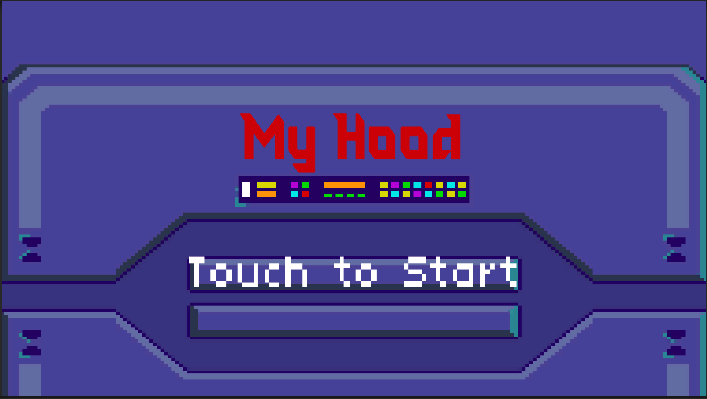

# 2D Beat em up made by Unity
> Building a simple 2D beat em up game using assets from a Ray Wenderlich tutorial series found here: https://www.raywenderlich.com/5568-unity-beat-em-up-game-tutorial-getting-started and tutorial + assets from this channel: https://www.youtube.com/watch?v=4nZWviEz2D8&list=PLgTmU6kuSLtzpYOPdk7o0wjwioYqwVibE&index=2

This project was a means of exploring and learning the Unity engine. It was also used for university project, not for any commercial uses.

## Gameplay demo :video_game:

## Screenshots :framed_picture:

## Credits :mag_right:
:boy: Trần Quốc Tuấn
:boy: Phạm Vũ Duy
:boy: Mai Đăng Khánh